## Scratch for GrownUps
  
Christian H&ouml;rauf 
@fonzygruen

??VERTICAL
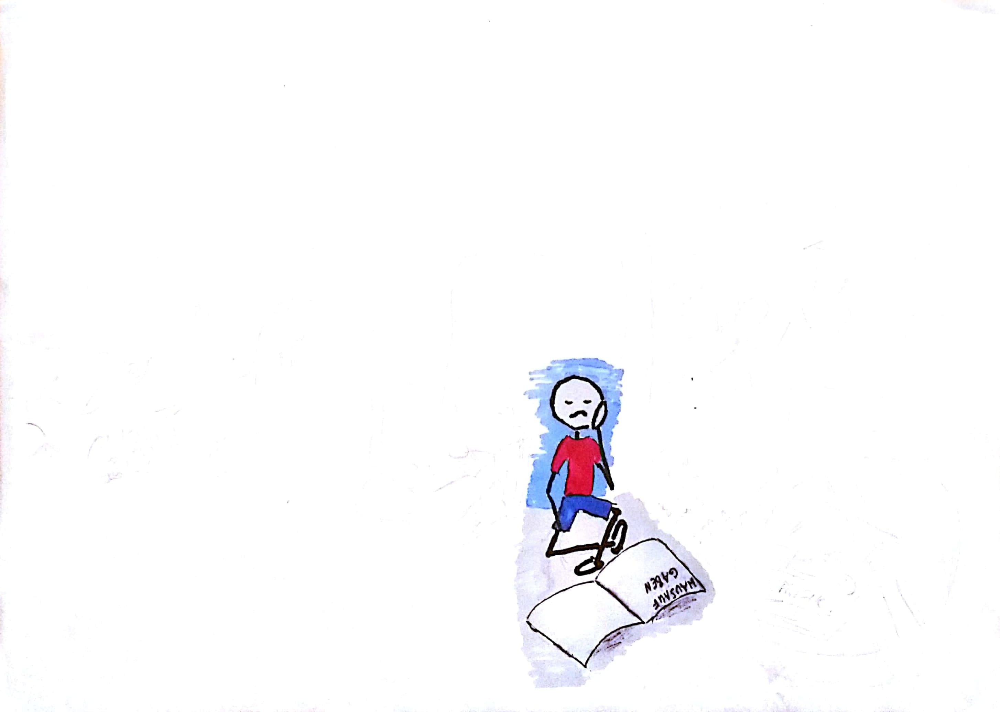

??VERTICAL
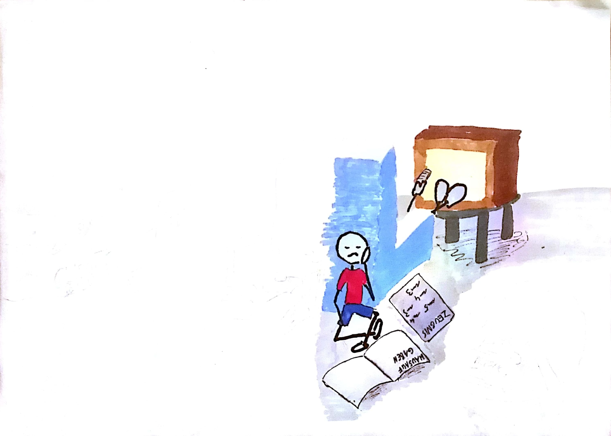

??VERTICAL
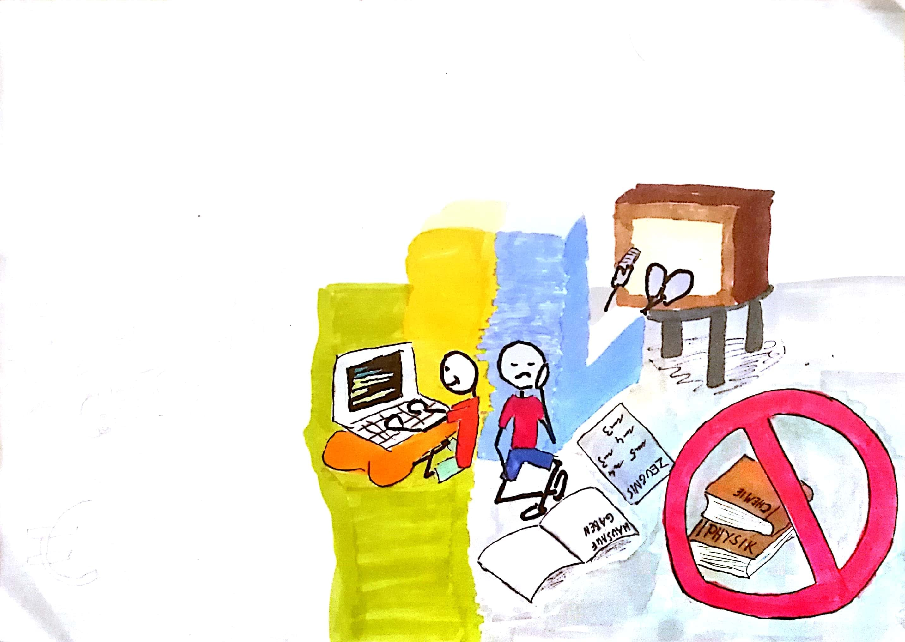

??VERTICAL
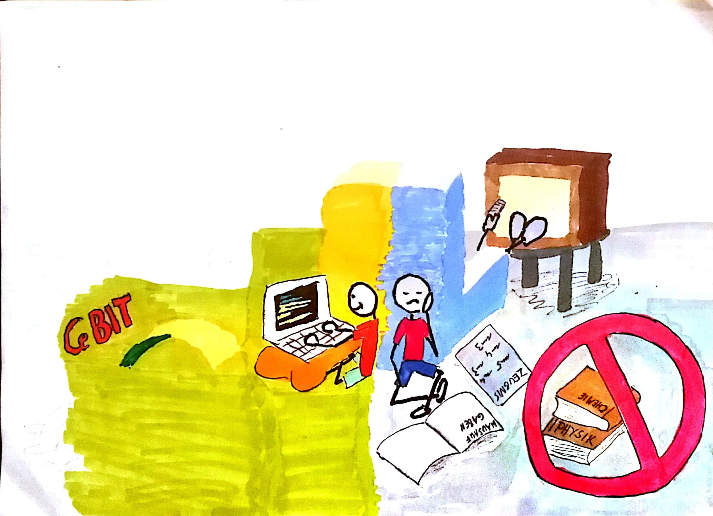

??VERTICAL
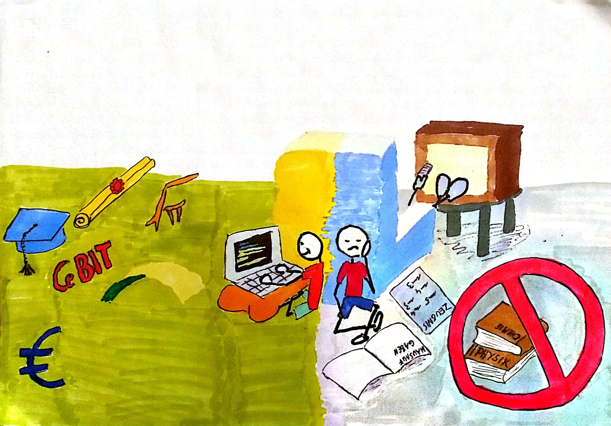

??VERTICAL
### Ich bin Ihre Zielgruppe

??VERTICAL
### Warum ist programmieren schwer?
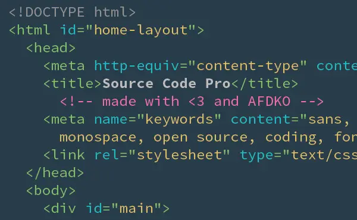

??VERTICAL
### Förderung der Selbstwirksamkeit

??VERTICAL
### Gruppendynamik

??VERTICAL
### Nach oben offen
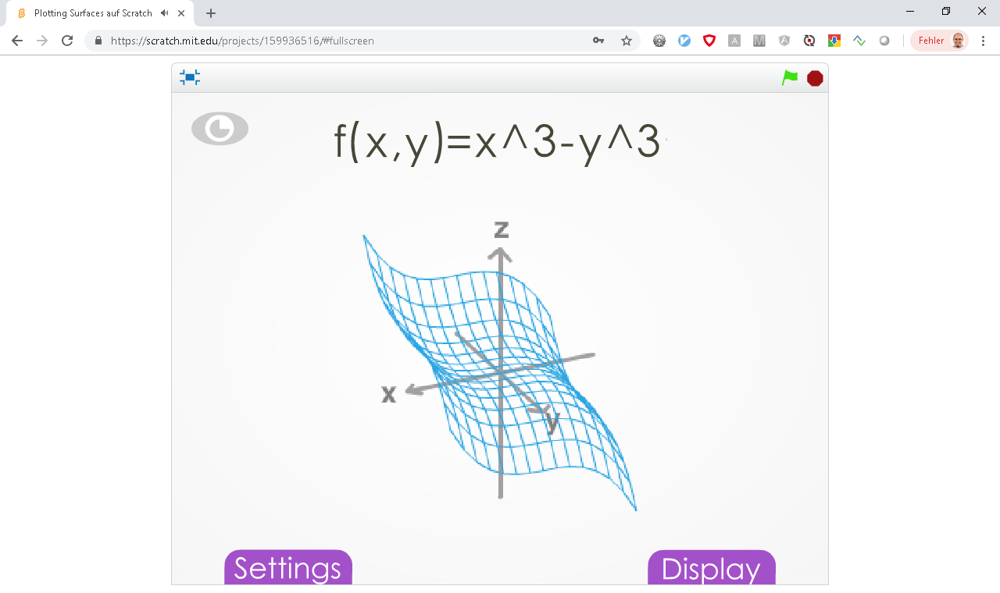

??VERTICAL
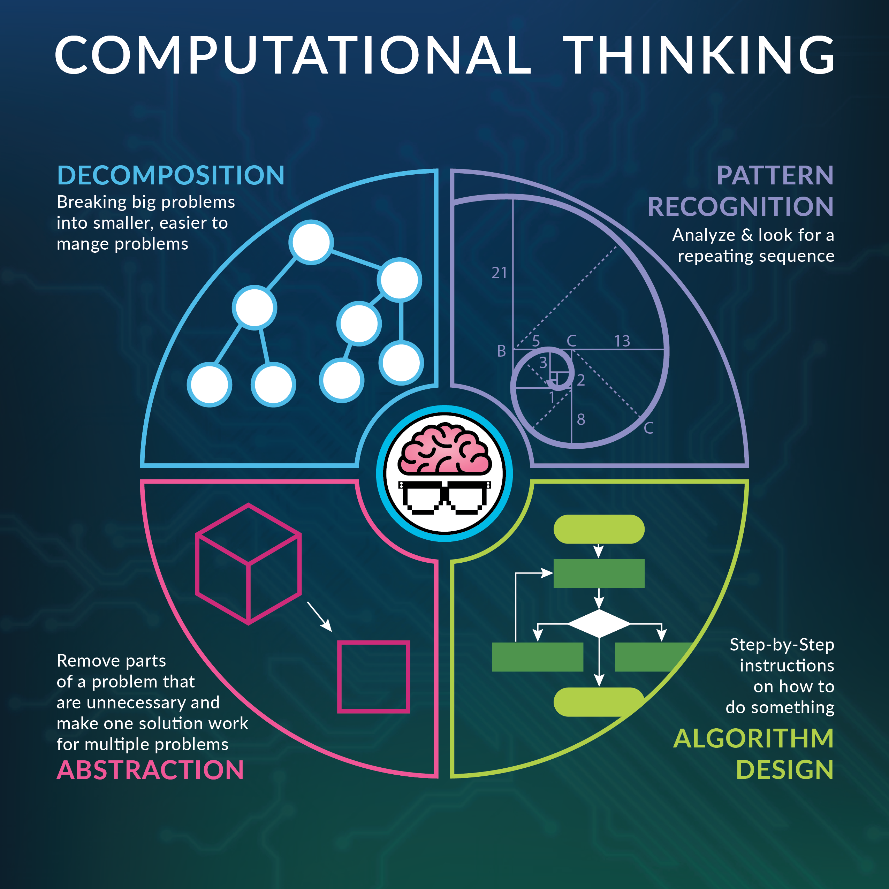

??VERTICAL
### Selbsteinschätzung

* Ich kenne die meisten Funktionen der Software, die ich besitze <!-- .element: class="fragment" -->
* Es fällt mir leicht die Bedienung einer Software zu erlernen <!-- .element: class="fragment" -->
* Ich kenne mich im Bereich Programmierung aus <!-- .element: class="fragment" -->

??VERTICAL

??VERTICAL
### Scratch 1
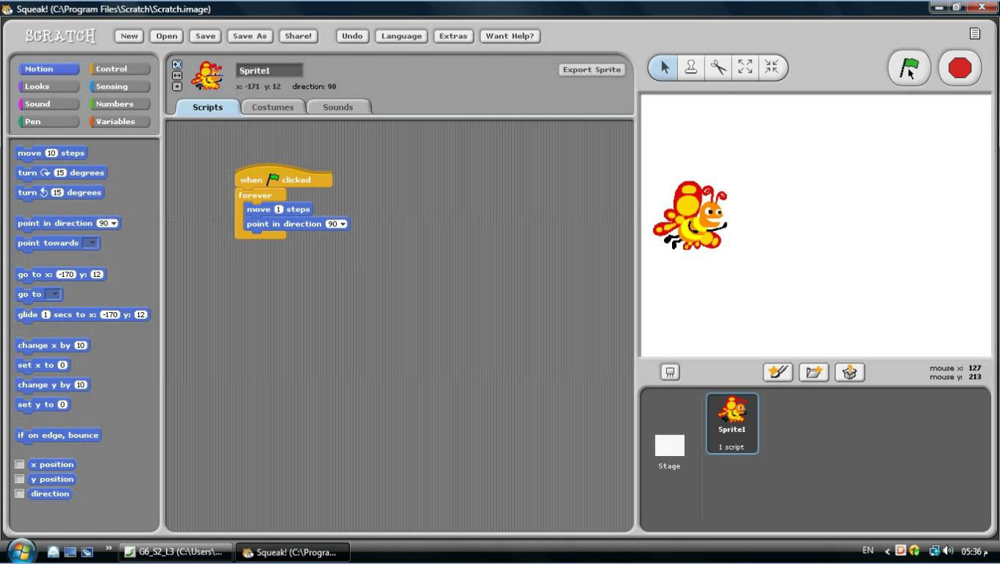

??VERTICAL
### Scratch 2
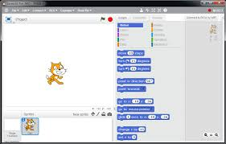

??VERTICAL
### Scratch Jr
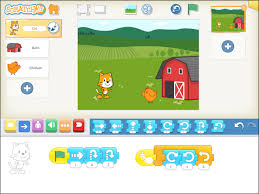

??VERTICAL
### Scratch 3
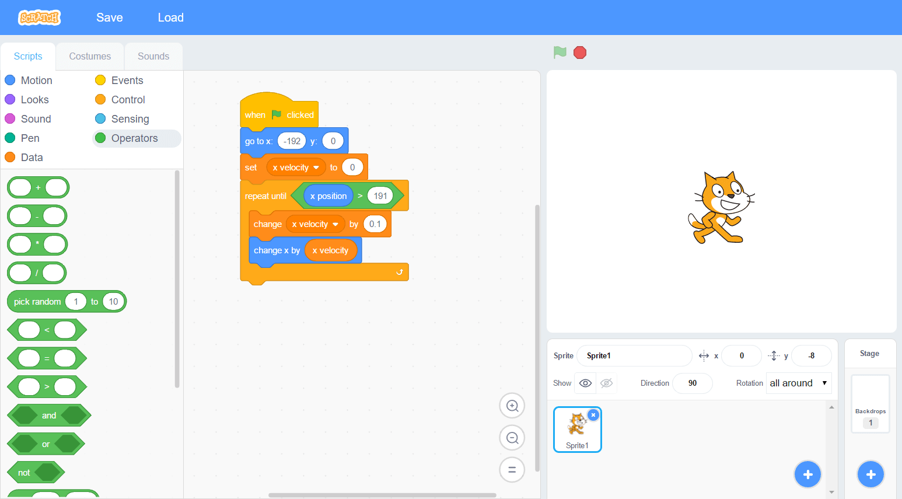

??VERTICAL
### Klassen-Einrichtung

??VERTICAL
### Übungsaufgabe

??VERTICAL
### Stolper Fallen
* Anweisungen zur Variablenmanipulation <!-- .element: class="fragment" -->
* Falsch markiertes Sprite <!-- .element: class="fragment" -->
* Gleichzeitigkeit <!-- .element: class="fragment" -->
* Globale Variablen <!-- .element: class="fragment" -->
* Scheinbares nicht ausführen <!-- .element: class="fragment" -->

??VERTICAL
# Vielen Dank für Ihre Aufmerksamkeit